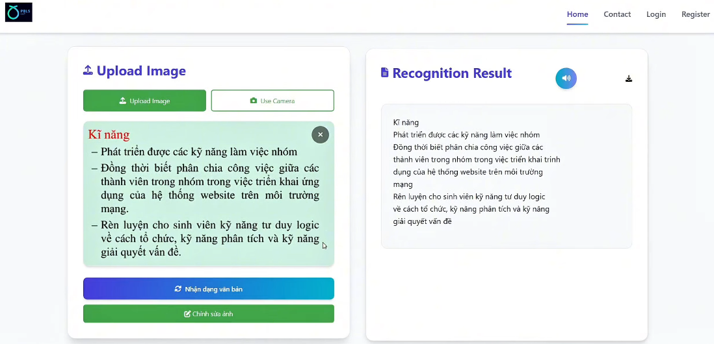
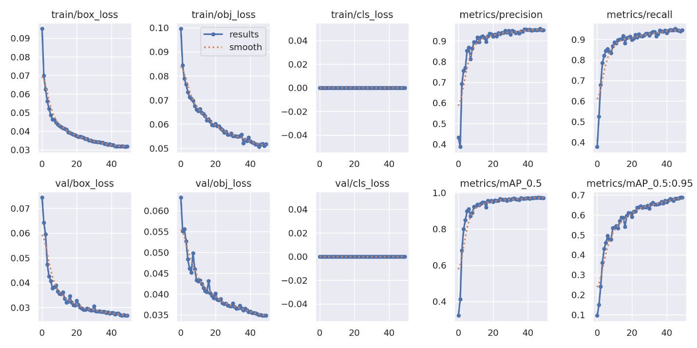
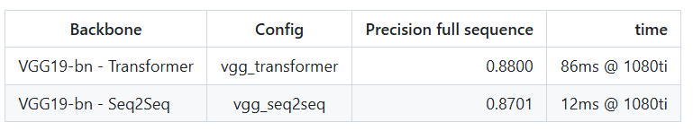

# 🇻🇳 Vietnamese OCR System with YOLOv5 + VietOCR

This project is a complete Vietnamese OCR pipeline that **combines object detection and sequence modeling** to detect and recognize text in images. The system uses **YOLOv5** for text region detection and **VietOCR** (Transformer-based) for recognizing the text content.

---

## Demo

**You can watch the video demo [here](https://www.youtube.com/watch?v=-sWo-P3ch0E)**

   

---

## Overview of the System

The pipeline consists of two main stages:

1. **Text Detection** (YOLOv5):
   - We use **YOLOv5** as the **text detector**.
   - It is a fast and accurate real-time object detection algorithm.
   - The model is trained (or fine-tuned) to detect text areas in input images and return bounding boxes around them.
   - These cropped regions are then passed to the next stage for recognition.

   
  <em>Figure: Detection results</em>

2. **Text Recognition** (VietOCR):

- We use **VietOCR**, a deep learning-based text recognizer optimized for Vietnamese.
- VietOCR architecture consists of two main components:
  - **VGG-style CNN** for **feature extraction**: Converts input images into visual feature sequences.
  - **Transformer encoder-decoder**: Translates the visual features into Vietnamese character sequences.
- Unlike traditional OCRs using CTC, VietOCR uses **Seq2Seq with attention**, making it highly accurate for Vietnamese with diacritics and complex scripts.

   
  <em>Figure: VietOCR results</em>

---

## Contributing

Feel free to open issues or pull requests if you'd like to improve this project or add new features.

## License

This project is open-source and available under the MIT License.

---

### References
- [VietOCR - pbcquoc/VietOCR](https://github.com/pbcquoc/vietocr)
- [YOLOv5 - Ultralytics](https://github.com/ultralytics/yolov5)

---

Thank you for checking out this project! If you find it useful, feel free to ⭐️ star the repository and share it with others.
